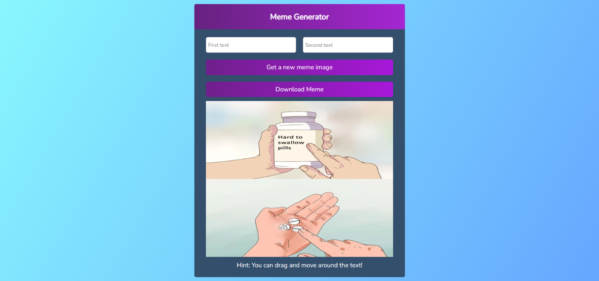

# Random Meme Generator

###  Created Random Meme Generator using React.js

# Screenshot:

## Features:

1.Used Imgflip Meme API to generate memes images.

2.You can download meme images in png format.

3.You can drag and move around the text.

### Todos:

1.Make Responsive.

2.To increase the text size.

3.To add more than 2 text inputs

